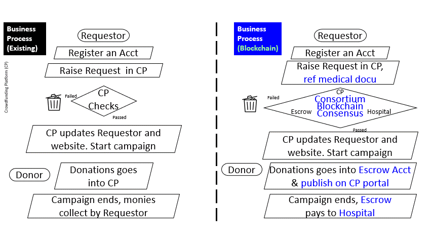
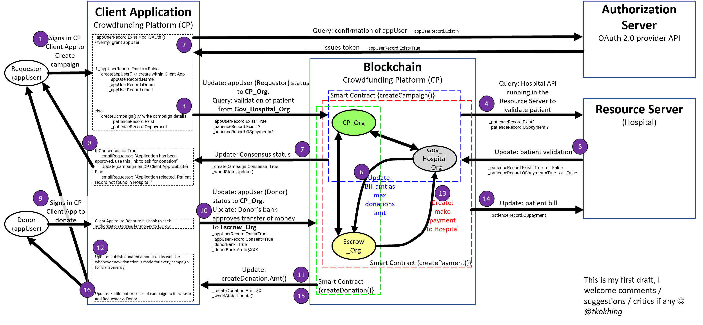

# OneHeart Crowdfunding Project (Hyperledger Fabric Blockchain)
This is a project by Team 1 of IMVCS-1101. 

I covered (i) Enterprise Design Thinking (EDT), (ii) developed the coding for the Smart Contract using [VS Code](https://marketplace.visualstudio.com/items?itemName=IBMBlockchain.ibm-blockchain-platform) and (iii) profiles in the [IBM Blockchain Platform \(IBP)](https://cloud.ibm.com/docs/blockchain/howto/ibp-v2-deploy-iks.html#ibp-v2-deploy-iks), while the other three members looked into other aspects. 

**Project Outcome**: Out of six, we were the _**only team**_ that had developed a working prototype blockchain architecture presented on 22 July 2021. What this means that all the transactions (or, donations) were made via our dedicated OneHeart gateway that I developed. In addition, the donations were added up instantaneously and recorded on the blockchain enforced by the Smart Contract - the most crucial feature demostrating that C.P.I.F had reached. 

**Documentation**: I hope that this recording of my [coding journey](https://github.com/tkokhing/OneHeart#my-coding-development-journey) can help future learners embarking on a blockchain development journey, as well as charting out what is next for myself now that the project has ended. Along with it, a brief [project outline](https://github.com/tkokhing/OneHeart#project-outline) as shown below. I also shared some **salient points** on other [lab exercises](https://github.com/tkokhing/Adventures/tree/main/IBM_myNotes) to enrich the learning.  

--------------------------------------

## What's Next for Me

The journey never stops. There are more to dive into. 
* configure IBP on different machine simulating a different org while adding more attributes and peers
* develop Smart Contract in other languages with more complexity 
* create cloud native (client) applications to interface with the blockchain
* continue to research deeper into cybersecurity fences 

_Above ALL, and Always_
 
--------------------------------------
## Project Outline
--------------------------------------
Crowdfunding is a way of raising funds by asking the public for a, large or small, amount of money as a form of donation. This project aims to create a new business process using blockchain technology. 

**Before you proceed**: I always believe that tutorials should provide a snapshoot of final outcome first so that students know what is expected. Here is a 30-sec clip on the completed prototype. If it is not what you are looking for, search other gits. 

### Current Vs Reviewed Business Process 
Below listed 5 problems with the current business process which our team had identified. Combining the used of blockchain technology, the proposed solution is as shown.  

### Communications
This is the first draft design of the software coding communications flow between client application, blockchain consortium, and authorization and resource servers. 

--------------------------------------
## My Coding Development Journey
The codes are modified from open source in the IBM tutorial, tested using 1 and 2 Orgs templates* (2 CA, 2 peer, 1 channel) **before** moving onto the IBM Blockchain Platform. 

(*see Step four*): https://cloud.ibm.com/docs/blockchain-sw-251?topic=blockchain-sw-251-develop-vscode#develop-vscode-guided-tutorials

**My 2 cents worth...**

* Obviously to build your own blockchain, modify from the examples to form your _Organizations_, _Channels_, _Ordering Services_ and others to suit your needs. I strongly recommend that you copy and paste the tutorials out so that you can make you own notes along the way. 
* Do screenshoots to capture the changes, and purposely do the wrong steps so that to test out different settings/scenarios. _I did all of these_. 
* Consider this! If plainly follow the tutorial shown below can build up a blockchain, everyone would have successfully done so, **but it is not**. 

**Sample Network Tutorial series**

:+1: IBM has rich tutorial resources! :+1: 

I followed this three-part tutorial series that explain the process of creating a simple multi-node Hyperledger Fabric network that builds on [Kubernetes](https://www.ibm.com/cloud/kubernetes-service) allowing the deployment of a smart contract. Here are **some key points** to note: 

* Most of the IBM tutorials are in [Hyperledger Fabric v1.4](https://hyperledger-fabric.readthedocs.io/en/release-1.4/), like the one i referenced to. However, I ran it on Fabric v2.x. i.e. the peers and channels created in IBM Blockchain Platform (IBP) must be running a Fabric v2.x image too. You have to catch the difference. 
* The goodness of this tutorial is that it tells you when to check your Wallet, i.e. progressively check if you are on the right direction.
* With sample usernames and pw, it tells you at which configuration to make reference to them, thus making sure you do not go wrong. 

**Tutorial 1 - Build a network**

Follow this tutorial to build up a basic blockchain network with one organization and an ordering service. 
* In my own words, you are playing the role of Developer A for Org A kick-starting a blockchain network. This will then become the first step for other organizations to join your business network.
> https://cloud.ibm.com/docs/blockchain/howto?topic=blockchain-ibp-console-build-network#ibp-console-build-network  

* There are three videos guides embedded in tutorial 1 as shown:
  * [Deploy a peer using the IBM Blockchain Platform](https://www.youtube.com/watch?v=PAC0PPPFxLE&t=15s) 
  * [Deploy an ordering service using the IBM Blockchain Platform](https://www.youtube.com/watch?v=lapmfN_tucg&t=10s) 
  * [Create and join a channel using the IBM Blockchain Platform](https://www.youtube.com/watch?v=iFAl66ee-Qs) 

**Tutorial 2 - Join a network** 

How can a consortium work with just one organization? So...
* Study this tutorial (no video guide for this tut) to create more organizations and add them the network that you built.
* What is not stated clearly is that you are playing this role of Developer B from Org B creating your organization **in the different machine using different account** in order to join an existing network created in tutorial 1. This is what in the real-world is happening. 
* For learning purpose, you probably doubled-role and creating the all these (Org A and Org B) on the same machine like what I did. But, know the difference!
> https://cloud.ibm.com/docs/blockchain?topic=blockchain-ibp-console-join-network#ibp-console-join-network

**Tutorial 3 - Deploy a smart contract on the network using Fabric v2.x** 

Finally, deploy your smart contract on a network. 
> https://cloud.ibm.com/docs/blockchain?topic=blockchain-ibp-console-smart-contracts-v2#ibp-console-smart-contracts-v2

--------------------------------------

## The Output

Here shows some essential steps to check along the way to ensure that you are on the right track.

* Inside my IBM Cloud account, do check that on the Kubernetes dashboard for proper deployment

* Here's a look at what IBM Blockchain Platform is capable of enabling me to built in a short time span. Of course, this is built as a prototype only. 

* As you add more CAs and Peers, do also check that their Identities are correspondingly created in the Wallet tab

* At the development stage, define the purpose of the different channels clearly, such as:
  * which user to achnor which identity
  * which Org is the lead Org in making changes
  * how many orgs are needed to commit changes

