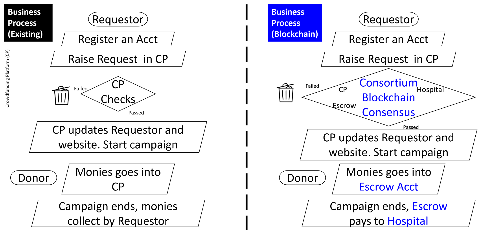

# OneHeart
**This is for building out OneHeart Crowdfunding Project**

Crowdfunding is a way of raising funds by asking the public for a, large or small, amount of money as a form of donation. This project aims to create a new business process using blockchain technology as shown below. 

The codes are modified from the IBM tutorial as shown, using 2 Org template (2 CA, 2 peer, 1 channel) (*see Step four*): https://cloud.ibm.com/docs/blockchain-sw-251?topic=blockchain-sw-251-develop-vscode#develop-vscode-guided-tutorials
