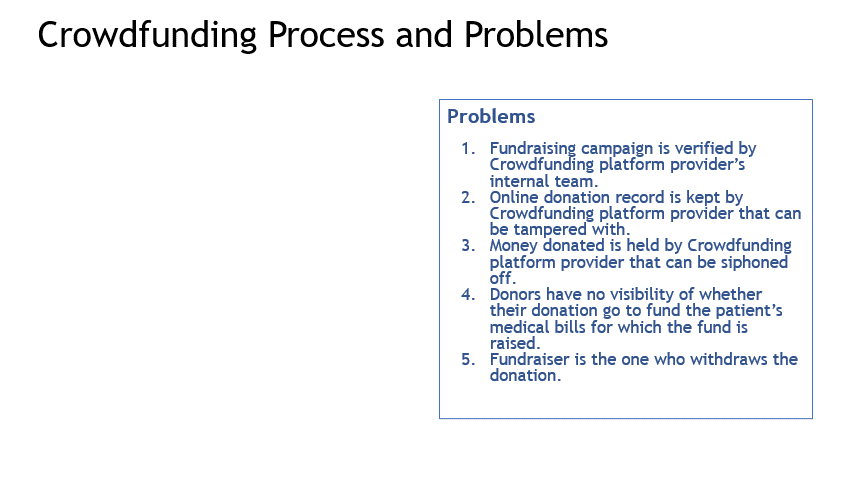
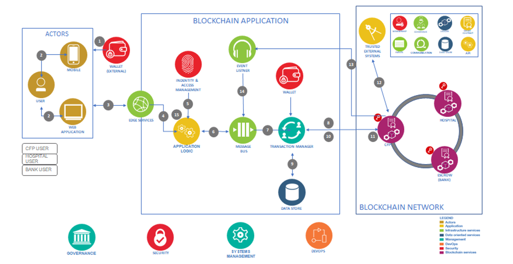

# OneHeart Crowdfunding Project 
This is a project by Team 1 of IMVCS-1101. I covered (i) Enterprise Design Thinking (EDT), (ii) developed the coding for the Smart Contract and (iii) profiles in the IBM Blockchain Platform, while the other three members looked into other aspects. Out of six, we were the _**only team**_ that had developed a working blockchain architecture. 

All transactions (aka donations) were made via our dedicated OneHeart gateway - connection profile of the blockchain which I developed. The donations were added up instantaneously and recorded on the blockchain - the most crucial feature demostrating that consensous has reached.

I am **documenting** this as I hope it can help future learners embarking on a cybersecurity/blockchain journey. Here goes...

## Overview
Crowdfunding is a way of raising funds by asking the public for a, large or small, amount of money as a form of donation. This project aims to create a new business process using blockchain technology. 

### Current Situation
Below listed 5 problems with the current business process which our team had identified.

### Reviewed Business Process 
Combining the used of blockchain technology and a reviewed on the business process, the proposed solution is as shown.  

### Communications
This is the first draft design of the software coding communications flow between client application, blockchain consortium, and authorization and resource servers. 

### Architecture 
Implementing the software communications flow into the architecture. 

## My Coding Development Journey
The codes are modified from open source in the IBM tutorial, tested using 1 and 2 Orgs templates* (2 CA, 2 peer, 1 channel) **before** moving onto the IBM Blockchain Platform. 

(*see Step four*): https://cloud.ibm.com/docs/blockchain-sw-251?topic=blockchain-sw-251-develop-vscode#develop-vscode-guided-tutorials

To build the blockchain, I followed the below tutorial series (extracted here for easy reference). It even tells you when to check your Wallet which no other tutorials give you that resolution. To me, this is really helpful. It also provided sample usernames and pw to make sure you do not go wrong. Obviously to build your own blockchain, modify it to suit your needs. 

_**My 2 cents worth...**_ I strongly recommend that you copy and paste the tutorial into a DOCX so that you can make you own notes along the way. Also do screenshoots to capture the changes, and purposely do the wrong steps so that to test out different settings/scenarios. _I did all of these_. Consider this! If plainly follow the tutorial can build up a blockchain, everyone would have successfully done so, **but it is not**. 

**Sample network tutorial series**  
IBM has rich tutorial resources. This three-part tutorial series explains the process of creating a simple multi-node Hyperledger Fabric network that builds on Kubernetes allowing the deployment of a smart contract. 
 
**Tutorial 1 - Build a network**
This tutorial guides you through the process of hosting a network by creating two organizations, one for your peer and another for your ordering service, and a channel. Use this tutorial if you want to form a blockchain consortium by creating an ordering service and adding organizations. 
> https://cloud.ibm.com/docs/blockchain/howto?topic=blockchain-ibp-console-build-network#ibp-console-build-network  

The videos for tutorial 1 are:
  * [Deploy a peer using the IBM Blockchain Platform](https://www.youtube.com/watch?v=PAC0PPPFxLE&t=15s) 

  * [Deploy an ordering service using the IBM Blockchain Platform](https://www.youtube.com/watch?v=lapmfN_tucg&t=10s) 

  * [Create and join a channel using the IBM Blockchain Platform](https://www.youtube.com/watch?v=iFAl66ee-Qs) 

**Tutorial 2 - Join a network** 
This tutorial guides you through the process of joining an existing network by creating a peer and joining it to an existing channel. Use this tutorial if you either do not intend to host a network by creating an ordering service, or want to learn the process for joining other networks.  
> https://cloud.ibm.com/docs/blockchain?topic=blockchain-ibp-console-join-network#ibp-console-join-network

**Tutorial 3 - Deploy a smart contract on the network using Fabric v2.x** 
This tutorial shows how to write a smart contract and deploy it on a network. 
> https://cloud.ibm.com/docs/blockchain?topic=blockchain-ibp-console-smart-contracts-v2#ibp-console-smart-contracts-v2

## Proof Of Concept

With the above, I had successful built, tested and proven a working prototype blockchain which our team presented on 22 July 2021. 

--------------------------------------

# What's Next for Me

The journey never stops. There are more to dive into. (a) master linux, (b) development Smart Contract in other programming languages and with more complexity, (c) create cloud native (client) applications to interface with the blockchain, and (d) continue to research deeper into cybersecurity fences. 

<b>Above ALL, and Always<b>
 
--------------------------------------
